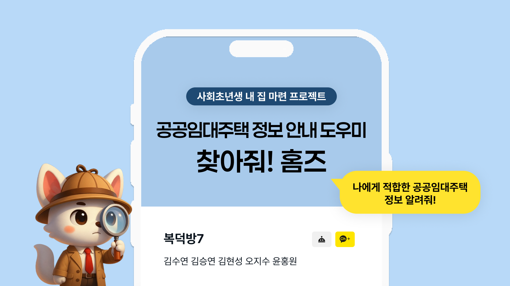

# 🏠 찾아줘 홈즈 / Find My Home  
**공공임대주택 정보 안내 도우미**  
**Public Rental Housing Information Assistant**

---

## 📌 소개 / Introduction

**찾아줘 홈즈**는 공공임대주택 정보를 쉽고 빠르게 찾을 수 있도록 도와주는 **AI 기반 챗봇 서비스**입니다.  
사용자의 **나이, 혼인 여부, 지역** 등의 정보를 기반으로 **맞춤형 공고를 추천**하며,  
**카카오톡**을 통해 간편하게 사용할 수 있습니다.

> 🔍 카카오톡에서 **"찾아줘! 홈즈"**를 검색해보세요!  
> ⚠️ *현재 LLM 모델은 리소스 문제로 중단된 상태입니다 (2025.04.22 기준)*

---

## 📁 업로드 폴더 설명 / Uploaded Folders Description

- `find-homes-dev`  
  → 카카오톡과 연동 시 사용되는 최종 코드

- `adding_vocab(csv-md)`  
  → CSV로 저장된 단어집을 Markdown으로 변환 및 통합하는 코드

- `Uploading, Testing`  
  → 데이터 업로드 및 초기 RAG 모델 테스트 코드

---

## 👀 작동 방식 / How It Works

  
  

---

## ⚙️ 시스템 아키텍처 / Architecture

  
  
  
  
  
  
  

---

## 🎯 프로젝트 개요 / Project Overview

- **목표 / Goal:**  
  사용자 맞춤형 공공임대주택 정보를 제공하여 정보 접근성을 향상시키고, 복잡한 정책 정보를 쉽게 전달합니다.

- **주요 기능 / Key Features:**  
  - 사용자 정보 기반 공고 추천  
  - 지역별 공고 검색  
  - 카카오톡 챗봇 UI  
  - RAG 기반 LLM 질의응답  
  - 인공지능 윤리 적용

---

## 🛠 프로젝트 구성 / Project Components

| 파트 | 설명 |
|------|------|
| 기획 & 분석 | 정책 데이터 수집 및 전처리 설계 |
| 백엔드 | Flask 서버, RAG 파이프라인 구축 |
| 프론트/챗봇 | 카카오톡 챗봇 UI, 사용자 흐름 설계 |
| LLM 최적화 | Query Rewriting, Prompt Engineering |

---

## 💻 사용 기술 스택 / Tech Stack

- **LLM:** OpenAI GPT-4 (Azure 기반)  
- **RAG:** Azure Cognitive Search + Custom Embedding  
- **백엔드:** Python, Flask, ngrok  
- **챗봇:** Kakao i Open Builder  
- **전처리 도구:** pandas, PyMuPDF, PDFMiner  
- **인프라:** Azure Functions, Blob Storage  

---

## 📚 데이터셋 및 처리 / Dataset & Processing

- **출처:** LH, GH, SH의 공공임대주택 공고 PDF
- **처리 방식:**
  - 제목 및 표 구조 추출
  - 텍스트 청킹 및 임베딩
  - BM25 + HNSW 인덱싱
  - LLM 연동용 프롬프트 구성

---

## 💬 챗봇 사용 시나리오 / Chatbot Use Cases

### 🗺 지역 기반 검색
> "서울에 있는 공공임대주택 뭐 있어?"

### 👤 맞춤형 추천
> "30대 미혼 남성인데 경기도에서 신청 가능한 공고 알려줘."

---

## 🚀 향후 개선 계획 / Future Improvements

- 다양한 자연어 표현 대응
- 네이버톡, 웹앱 등 타 플랫폼 연동
- 이미지 기반 공고문 요약 기능 추가

---

## 📄 더 알아보기 / More Information

더 자세한 내용은 첨부된 PDF 문서를 참고해 주세요!  
Check the attached PDF for more details.
